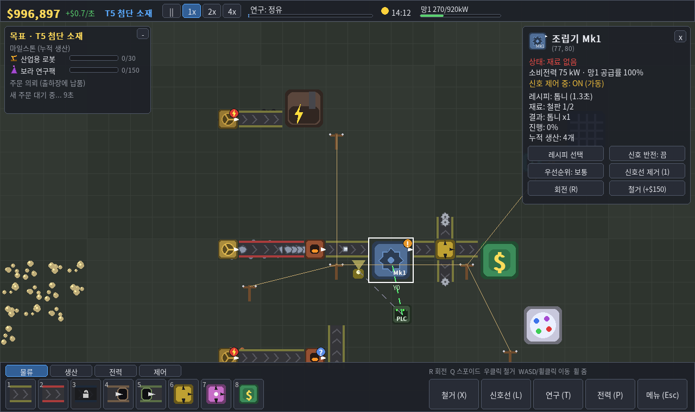
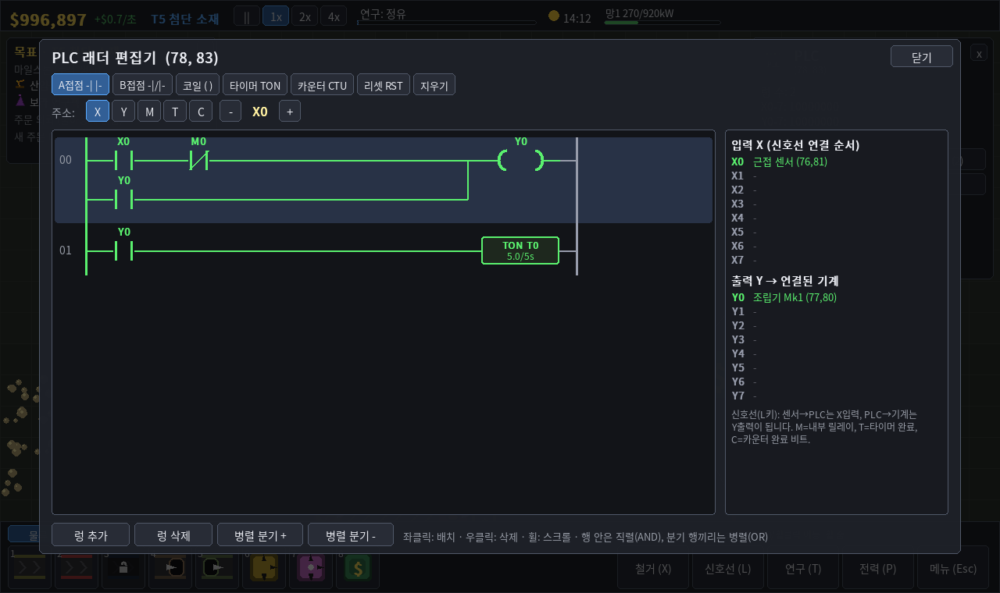

# 🏭 공장 자동화 타이쿤

광석을 캐서 판을 만들고, 부품을 조립하고, 연구로 다음 시대를 여는 2D 공장 자동화 게임.
T1 기초 산업부터 T5 첨단 소재까지 진행한 뒤 **무인 스마트 팩토리 코어**를 완성하면 엔딩입니다.



## ▶ 실행 (Windows)

1. [python.org](https://www.python.org/downloads/)에서 **Python 3.12** 설치 — 첫 화면에서 **"Add python.exe to PATH" 체크**
2. 이 폴더의 **`run.bat` 더블클릭**
   - 처음 한 번은 가상환경(`.venv`)을 만들고 패키지를 설치하느라 1~2분 걸립니다
   - 이후에는 바로 실행됩니다

창이 바로 꺼지면 cmd에서 `run.bat` 을 실행하거나 `내 문서\FactoryTycoon\crash.log` 를 확인하세요.

## 🎮 조작법

| 입력 | 동작 |
|---|---|
| 좌클릭 | 건물 설치 / 건물 선택(정보 패널) |
| 좌클릭 드래그 (벨트) | 벨트 연속 설치, 끄는 방향으로 자동 회전 |
| 우클릭 (드래그) | 철거 (75% 환불) |
| R / Shift+R | 회전 (설치 전 미리보기 또는 마우스 아래 건물) |
| Q | 스포이드 (마우스 아래 건물을 도구로 선택) |
| 1~0, Tab | 건물 선택, 카테고리 전환 |
| WASD / 방향키 / 휠클릭 드래그 | 화면 이동 |
| 마우스 휠 | 줌 |
| 스페이스 | 일시정지 |
| T / P / X / L | 연구 트리 / 전력망 / 철거 도구 / 신호선 도구 |
| F1 / F5 / Esc | 도움말 / 빠른 저장 / 취소·메뉴 |

## 🧭 시작 가이드

1. **전기부터**: 석탄 광맥(검은 점)에 채굴기 → 벨트 → **석탄 발전기**(2x2). 발전기 옆에 **전신주**.
2. **첫 수입**: 철광석 채굴기 → 벨트 → **제련로** → 벨트 → **출하장**(2x2). 기계 근처에 전신주를 이어서 전력을 공급하세요.
3. 왼쪽 **목표 패널**의 마일스톤(철판 300, 구리판 200)을 채우면 **T2 기계화** 시대가 열립니다.
4. T2부터 **조립기**(클릭 → 레시피 선택)와 **연구소**, 빨강 연구팩. `T` 키로 연구를 고르세요.
5. 기계를 너무 많이 달면 **차단기가 트립**됩니다. 발전기를 늘리고 상단 게이지의 `복구` 버튼을 누르세요.
6. 기계 위의 아이콘은 정지 원인입니다: ⚡ 전력 없음 · ! 재료 없음 · ■ 출력 막힘 · ? 레시피/연구 미설정 · / 신호 OFF

### 시대 진행
| 시대 | 핵심 |
|---|---|
| T1 기초 산업 | 채굴, 제련, 석탄 발전, 판매 |
| T2 기계화 | 조립기, 톱니·철봉·전선, 연구소, 🔴 연구팩 |
| T3 전기화 | 강철, 모터, 회로기판, 증기터빈, 변압기·철탑, 🟢 연구팩 |
| T4 자동 제어 | 센서, 릴레이, **PLC 래더 편집기**, 실리콘, 태양광·배터리, 🔵 연구팩 |
| T5 첨단 소재 | 원유·플라스틱·반도체·인버터·산업용 로봇, 원자력, 🟣 연구팩 |
| 최종 | 메가 프로젝트 → 엔딩 → 무한 연구 |

### PLC 래더 편집기 (T4)


- 신호선(`L`)으로 센서 → PLC 를 연결하면 연결 순서대로 X0, X1 …, PLC → 기계를 연결하면 Y0, Y1 …
- A접점 / B접점 / 코일 / 타이머(TON) / 카운터(CTU) / 리셋(RST). 한 행은 직렬(AND), 분기 행은 병렬(OR)
- 실행 중 통전된 선과 접점·코일은 초록색. 프로그램은 세이브 파일에 저장됩니다

## 💾 저장

- 저장 위치: `내 문서\FactoryTycoon\slot1.json ~ slot3.json`
- 5분마다 자동 저장(설정에서 끌 수 있음), `F5` 빠른 저장, 종료 시 자동 저장

## 📦 exe 만들기 (친구에게 보내기)

1. **`build.bat` 더블클릭** → 테스트 실행 → 아이콘 생성 → PyInstaller 빌드
2. 결과물: `dist\FactoryTycoon\FactoryTycoon.exe`
3. **`dist\FactoryTycoon` 폴더 전체**를 zip으로 압축해서 보내면 됩니다 (exe만 따로 보내면 실행 안 됨)

**Python 없는 PC에서 동작 확인하는 방법**
- 가장 확실한 방법: Windows 설정 → 시스템 → *Windows 샌드박스*(Pro 이상)를 켜고, 샌드박스 안에 zip을 복사해 실행
- 또는 Python이 설치되지 않은 다른 PC/가상머신에서 압축을 풀고 `FactoryTycoon.exe` 실행
- exe 폴더 안의 `_internal` 에 Python 런타임과 pygame/numpy가 들어 있어서 받는 사람은 아무것도 설치할 필요가 없습니다
- 백신이 처음 보는 exe라고 경고할 수 있습니다(PyInstaller 빌드에서 흔함). 폴더(onedir) 빌드라 단일 exe보다 오탐이 적습니다

## 🛠 개발

```
python -m pytest tests          # 시뮬레이션 + UI 입력 테스트 (헤드리스)
python main.py --smoke 120      # 120프레임 실행 후 자동 종료
python tests/ui_smoke.py shots  # 각 화면 스크린샷 저장
python tools/gen_design_tables.py  # data/*.json 수정 후 DESIGN.md 표 갱신
```

- 새 아이템/건물/레시피/연구는 `data/*.json` 만 추가하면 됩니다. 시작 시 참조 오류를 검사해 알려줍니다.
- 그래픽 교체: `assets/buildings/<건물ID>.png`, `assets/items/<아이템ID>.png` 를 넣으면 도형 대신 사용
- 설계 상세와 전체 수치표: [DESIGN.md](DESIGN.md)
